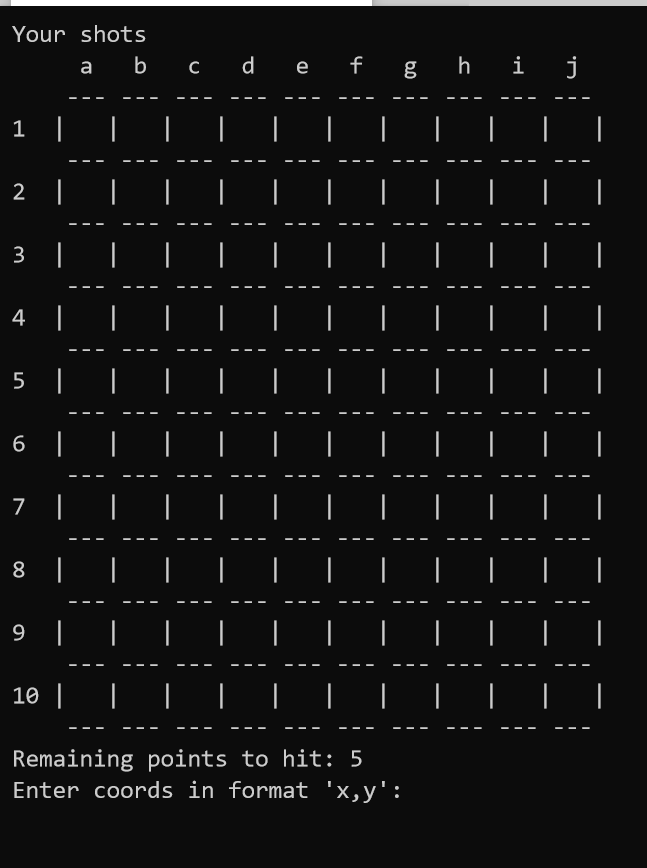

# Battleship Game

The goal of the game is to sink all ships in as few moves as possible.

# Gameplay
Every round you will have to provide the coords of your shot in format `x,y` where:
```
x - letter in range [a,j]
y - number in range [1,10]
```

- If you destroy enemy ship, on your map 'x' mark will appear.
- Unless you will see new 'o' mark on your map.


 # How to play it?
```
./batleship.sh [OPTION]...
```
## Available options
- `--help` or `-h` to show help
- `--DEBUG` to start game in debug mode use option

# Gameplay 
