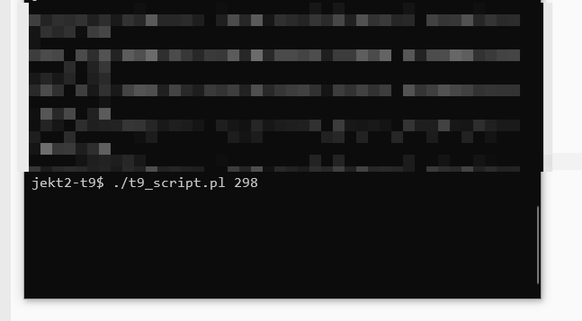

# Description

Program simulates t9 dictionary which in before was used in mobile phones.
User provides sequence of digits and all possible prompts for the digit sequence are written to `output.txt` file.

# How to use it?
```
./t9_script.pl [OPTION]... number_sequence
```
## Available options
- `-h` or `--help` - show help

## Remarks
- `number_sequence` may only contain from 2-9 digits
- `words.txt` is source of words that will be taken into account when searching prompts. You can provide here any words but you have to separate words with new line character.


# Demo
