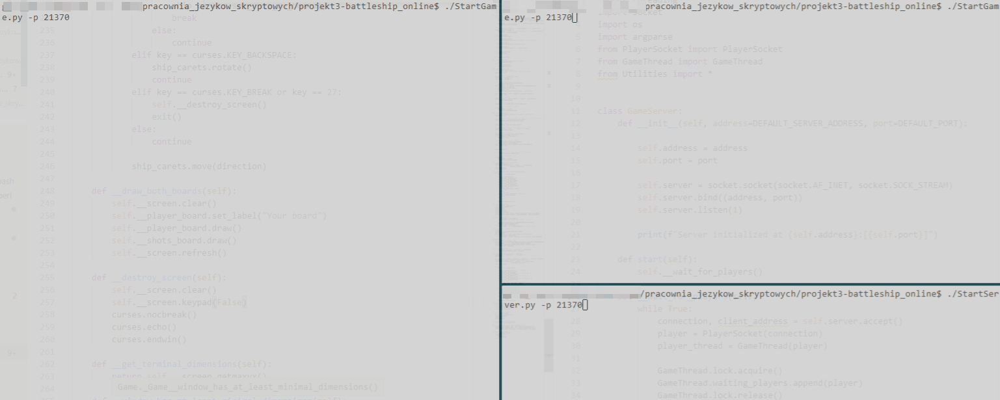

# Description
The goal of the game is to sink all enemy player ships before he/she will destroy yours.

At the beginning of the game you need to wait for other player if you connected server as first.

When other player joins game, you have to place your ships in such way he/she won't be able to hit them.

Then game begins. It's your or your opponent turn. 

The game lasts until one's player ships are destroyed.

# How to play it?
1. Start server on any port using `./StartServer.py -p port`
2. Start two clients that will take a part in game `./StartGame.py -p port`

# Navigation in Game:
- BACKSPACE - ship rotation in ships placement phase
- arrows - ship/shot caret movement
- SPACE - ship placement or takin a shot

# Available options in server/client
- `-h` or `--help` to show help
- `-p port` to set port on which server will start/on which player will try to find game

# Demo
